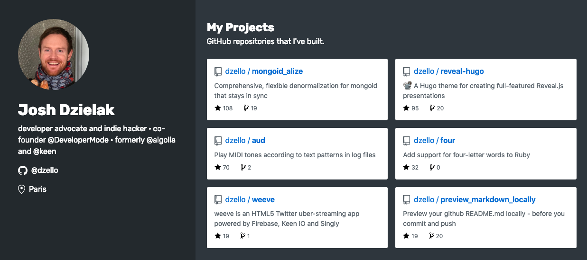
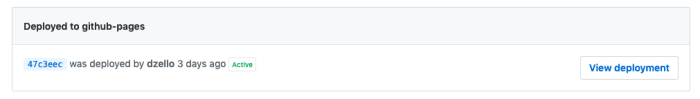

How to use the new github.dev personal website generator

  

**[github.dev](https://github.dev/)** is a new community project by GitHub that lives on the [.dev TLD](https://domains.google/tld/dev/). With it, you can fork, customize and deploy a personal site that shows your GitHub bio and contributions, powered by the [GitHub API](https://developer.github.com/v3/), [GitHub Pages](https://pages.github.com/), and [Jekyll](https://jekyllrb.com/).

> **See an example: [dzello.github.io](https://dzello.github.io/)**

Personally, I like this project because it gives developers an alternative way to showcase their coding talents and interests, beyond just their GitHub profile page, which some developers in the community have [raised good questions about](https://twitter.com/emmawedekind/status/1099235211555074048).

If you already know how to fork a repo and use the command line, I can show you how to get your own github.dev instance up and running in about 10 minutes.


## Get started

Point a browser window to the [github/personal-website](https://github.com/github/personal-website) repository.

1.  Click the Fork button to make a copy of the repository in your account
2.  Go to the Settings tab and rename the repository to `{username}.github.io`, substituting `{username}` for your GitHub username

Repositories named `{username}.github.io` do something really unique on GitHub. Their contents (specifically the _site folder) will automatically be deployed to a GitHub Pages URL and become available as a browsable website at this address:

```
https://{username}.github.io/

```

This is unfortunately not on the new github.dev domain itself, but I do hope the project’s name implies a plan for that 🤓.

Before the site appears, however, you need to push at least one commit to the repo after renaming it. We’ll do that in the following steps.

## Run locally

As a prerequisite, [install Ruby](https://jekyllrb.com/docs/installation/) if you don’t have it already.

First, clone your new repository.

```
git clone git@github.com:{username}/{username}.github.io.git

```

Next, `cd` into the repository and install Jekyll and dependencies.

```
cd {username}.github.io
gem install jekyll bundler
bundle install

```

Now you’re ready to start up the site.

```
bundle exec jekyll serve

```

Browse to [http://localhost:4000](http://localhost:4000/) and you should see a page with your name, profile photo and public repositories. This data is already present thanks to the [github-metadata Jekyll plugin](https://github.com/jekyll/github-metadata#authentication) and the [GitHub pages gem](https://github.com/github/pages-gem).

## Customization

No further customization is required (feel free to skip down to [#deployment](#deployment)), but do I recommend at least changing your interests so that your page accurately reflects who you are.

### Your interests

By default, github.dev assumes you are interested in CSS, Web Design, and Sass. But what if you prefer PostCSS or are not actually a devsigner? Don’t worry, it’s easy to change.


Open up `_config.yml` with your favorite text editor and find the `topics` section. Make changes to the YAML to add, update and remove topics. Here’s how you would add the [awesome topic](https://github.com/topics/awesome) for example:

```
topics:
  - name: awesome
    web_url: https://github.com/topics/awesome
    image_url: https://raw.githubusercontent.com/github/explore/c304601f028774885ef27f72e6fe2d331729d8bc/topics/awesome/awesome.png

```

Visit the [GitHub topics](https://github.com/topics) page to see what other interests you can add.

**After you make changes to `_config.yml`, you will need to stop Jekyll and restart it before they appear.** Changes to other files, however, should just require a page refresh.

### Show popular repos first (optional)

By default, repositories are sorted alphabetically. If instead you want your most-starred repos to be shown instead, you can make a change to the `_includes/projects.html` file.

```
<div class="d-sm-flex flex-wrap gutter-condensed mb-4">
  
  
    <div class="col-sm-6 col-md-12 col-lg-6 col-xl-4 mb-3">
      
    </div>
  
</div>

```

The important part is the `sort: 'watchers_count'` and `reverse`. There are other fields you can display or sort by too, see the documentation for the [github-metadata jekyll plugin](https://github.com/jekyll/github-metadata). You can also limit the total number of repositories shown, which I am doing above with `limit: 6`.

### 🔦 Dark mode (optional)

In `_config.yml`, you can set `style: dark`. This will make your visitors’ faces glow less while they are reading your site at night.

The [customization section](https://github.com/github/personal-website#customization) of the README contains several more ways to really make your site your own. You can even add a blog, too.


## Deployment

Each time you push new commits to GitHub, your site will be built and deployed to `https://{username.github.io}/`. At least one `git push` is required before the site is deployed for the first time.

Assuming you made some changes to your interests in the `_config.yml` file, here’s what you should do.

Add and commit your changes:

```
git add _config.yml
git commit -m 'Updated my interests'

```

Then push them up to GitHub:

```
git push

```

Wait a few minutes and your site should be live at `https://{username}.github.io/`. 🎉

You can confirm this in the environment tab on the GitHub repo:



Troubleshooting: if for some reason the site doesn’t load after a few minutes, try the URL `https://{username}.github.io/index.html` instead. If that works, there may have been a caching issue, and you’ll just need to wait a bit before you can access the site without the `index.html`.

## Congratulations!

Are you excited about your new site? ✨ Let’s hear about it [over on dev.to](https://dev.to/developermode/how-to-use-the-new-githubdev-personal-website-generator-1fde). Tell us about any customizations that you made that others might want to try too.

That’s it for the tutorial. If you want to see more sites and community projects making their home on the new .dev domain, check out [awesome-dot-dev](https://github.com/developermode/awesome-dot-dev) ⭐.

* * *

#### Discuss on twitter