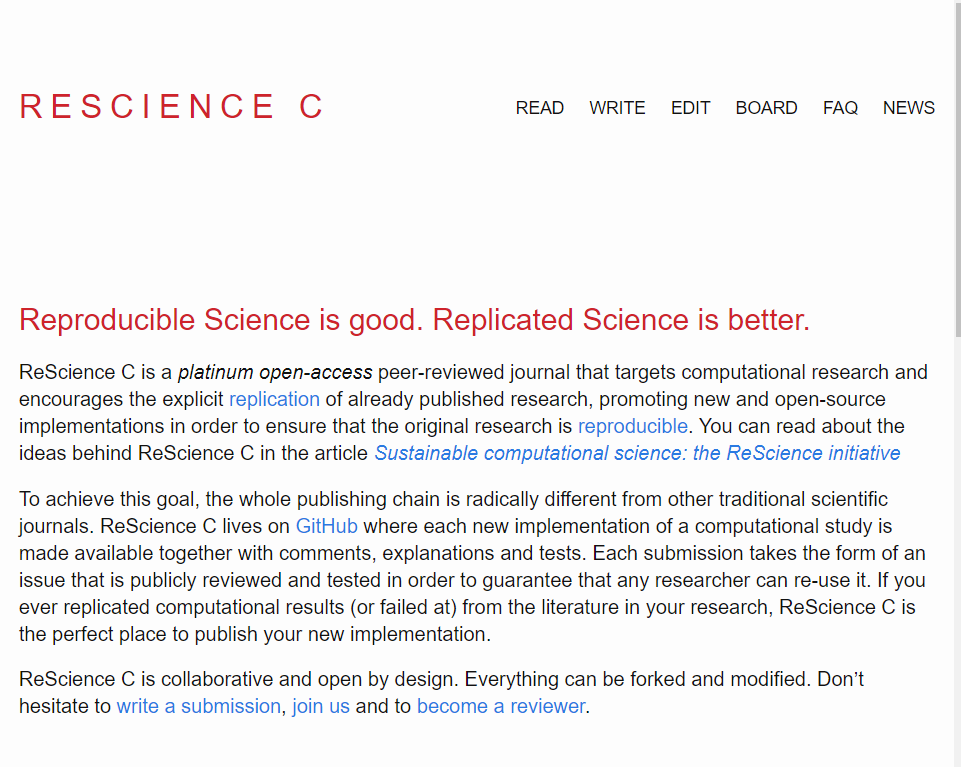

# ReScience C

ReScience C is a open source journal hosted and curated entirely on github. This journal has been active for over three years and is a interesting concept were computational reproducibility is reached and documented in a totally transparent and reproducible manner.

## `Typora` text editor

There are many different markdown editors to pick from but generally they range from raw txt to a "what you see is what you get" type of editor. One option for this type of editor I like is called `typora`.

#### Quick NOTE: *The configuration of image file locations can be hard to get configured correctly if, in my case you don't have a good grip of the relationship between relative and absolute paths when configuring image paths.*

## Additional information

<ul>

  <a href="{{ post.url }}">{{ post.title }}</a> ({{ post.date | date_to_string }}) 
    {{ post.description }}

</ul>

