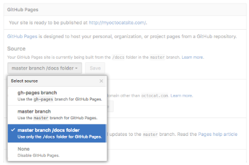

# Publishing on GitHub using `github pages`

GitHub Pages is available in public repositories with GitHub Free, and
in public and private repositories with GitHub Pro, GitHub Team, GitHub
Enterprise Cloud, and GitHub Enterprise Server. For more information,
see “[GitHub’s
products](https://help.github.com/articles/github-s-products).”

You can configure GitHub Pages to publish your site’s source files from
`master`, `gh-pages`, or a `/docs` folder on your `master` branch for
Project Pages and other Pages sites that meet certain criteria.

If your site is a User or Organization Page that has a repository named
`<username>.github.io`or `<orgname>.github.io`, you cannot publish your
site’s source files from different locations. User and Organization
Pages that have this type of repository name are only published from the
`master` branch.

For more information about the different types of GitHub Pages sites,
see “[User, Organization, and Project
Pages](https://help.github.com/en/articles/user-organization-and-project-pages).”

## [Publishing your GitHub Pages site from a `/docs` folder on your `master` branch](#publishing-your-github-pages-site-from-a-docs-folder-on-your-master-branch)

To publish your site’s source files from a `/docs` folder on your
`master` branch, you must have a `master` branch and your repository
must:

-   have a `/docs` folder in the root of the repository
-   not follow the repository naming scheme `<username>.github.io`or
    `<orgname>.github.io`

GitHub Pages will read everything to publish your site, including the
CNAME file, from the `/docs` folder. For example, when you edit your
custom domain through the GitHub Pages settings, the custom domain will
write to `/docs/CNAME`.

1.  On GitHub, navigate to your GitHub Pages site’s repository.

2.  Create a folder in the root of your repository on the `master`
    branch called `/docs`.

3.  Under your repository name, click **Settings**.

    

4.  Use the Select source drop-down menu to select **master branch /docs
    folder** as your GitHub Pages publishing source.

    

    **Tip:** The **master branch /docs folder** source setting will not
    appear as an option if the `/docs` folder doesn’t exist on the
    `master` branch.

5.  Click **Save**.

    

### [Further Reading](#further-reading)

-   [Viewing branches in your
    repository](https://help.github.com/en/articles/viewing-branches-in-your-repository/)

#  DISCUSSION

<iframe src="https://discord.com/widget?id=921966599181856818&theme=dark" width="350" height="500" allowtransparency="true" frameborder="0" sandbox="allow-popups allow-popups-to-escape-sandbox allow-same-origin allow-scripts"></iframe>
